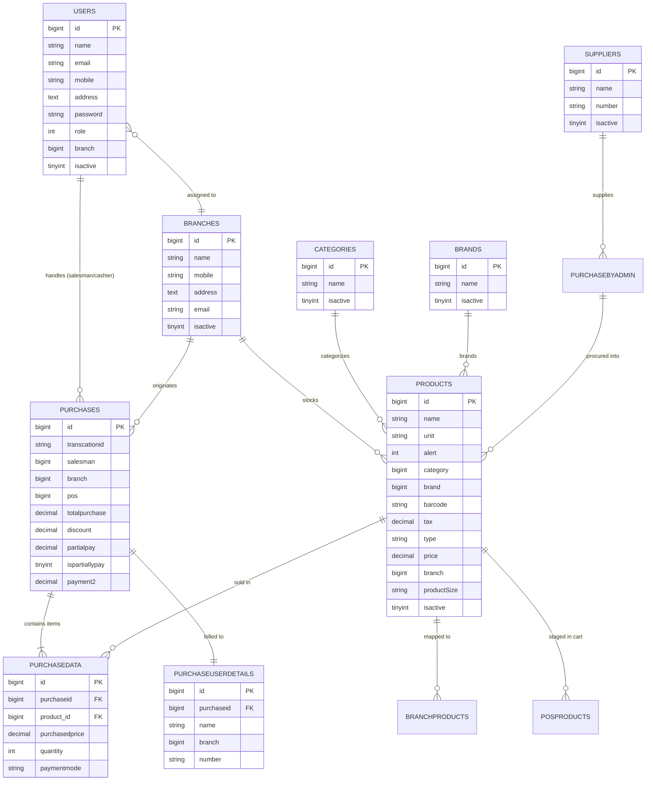

# VastraSync — Ethnic Wear Manufacturing, Inventory & Retail POS ERP

[](https://laravel.com)
[](https://www.php.net)
[](https://www.mysql.com)
[](https://getbootstrap.com)
[](https://www.linkedin.com/in/pulipati-sairam-b14820169/)
[](LICENSE)

---

## 📌 Overview

**VastraSync** is an enterprise-grade ERP, Multi-Branch Inventory Management, and Point of Sale (POS) system engineered with **Laravel 10 LTS** and **PHP 8.2**. Designed specifically for high-end ethnic wear fashion houses, bridal & groom apparel manufacturing units, multi-branch designer showrooms, and custom tailoring boutiques.

The platform unifies the end-to-end apparel lifecycle: from raw fabric procurement and batch manufacturing to Code-128 barcode tagging, multi-branch stock transfers, tailor alteration advances, high-speed POS checkout, and GST-compliant thermal/A4 billing.

Developed and maintained by **[Sairam Pulipati](https://www.linkedin.com/in/pulipati-sairam-b14820169/)**.

---

## 📸 Application Showcase

### 1. Modern Luxury Authentication & Role Access


### 2. Showroom Overview & Financial Analytics Dashboard


### 3. High-Speed POS Billing & Barcode Terminal


### 4. Multi-Branch Staff Management & Role-Based Access Control (RBAC)


---

## ✨ Key Features & Capabilities

### 🛒 1. Point of Sale (POS) & Retail Showroom Checkout
- **Instant Barcode / SKU Scanning**: Real-time barcode lookup optimized for handheld laser scanners at retail counters.
- **Dynamic Cart Management**: Live item pricing, quantity adjustments, order line subtotals, and automatic tax computation.
- **Customized Garment & Tailoring Support**: Accommodates ready-to-wear apparel (Sherwanis, Kurtas, Indo-Western sets) and bespoke tailoring orders.
- **Flexible Settlement Engine**: Supports 100% Cash/Card settlement, partial advance bookings for fitting trials, and secondary balance collections.

### 🏢 2. Multi-Branch & Warehouse Inventory
- **Multi-Showroom Federation**: Partition or aggregate catalog stock across multiple flagship branches (e.g., Hyderabad Flagship HQ, Vijayawada Showroom).
- **Stock Depletion & Low-Stock Alerts**: Real-time decrement of showroom stock upon invoice generation with minimum threshold alarms.
- **Multi-Branch Stock Allocation**: Allocate production batches across warehouse hubs and retail branches simultaneously.

### 🏷️ 3. Barcode & GST-Compliant Invoicing Engine
- **Automated Code-128 Barcoding**: Dynamic barcode generation for every apparel SKU, garment size, and color variant.
- **Batch Barcode Sheet Printing**: High-density PDF barcode sheets ready for standard sticker rolls and hangtag printers.
- **Thermal & A4 Invoices**: PDF generation using `barryvdh/laravel-dompdf` for printable customer tax receipts and delivery bills.

### 📦 4. Fabric Procurement & Supplier Accounting
- **Vendor & Weaver Directory**: Track textile mills, embroidery artisans, and raw material suppliers.
- **Raw Material Procurement**: Record batch purchases of fabrics (silk, brocade, velvet), lining materials, buttons, and accessories.

### 👥 5. Role-Based Access Control (RBAC)
- **Role 1 (Super Admin)**: Complete system control, cross-branch financial reports, branch creation, and audit logging.
- **Role 2 (Showroom Manager)**: Local inventory oversight, sales monitoring, branch staff administration, and expense audits.
- **Role 5 (Sales Associate / Cashier)**: Fast POS billing, customer registry, barcode scanning, and receipt dispatch.

---

## 🗄️ Database Architecture & Entity Relationship Diagram (ERD)

The database schema has been reconstructed with modern migrations, foreign references, and realistic seed data:



---

## 🚀 Quick Start Guide

### Prerequisites
- **PHP**: `^8.2` (with `pdo_mysql`, `curl`, `gd`, `mbstring`, `openssl`, `zip`, `fileinfo` enabled)
- **Composer**: `^2.x`
- **Database**: MySQL `^8.0` / MariaDB `^10.4`
- **Web Server**: Apache / Nginx or Laravel built-in CLI server

---

### Step-by-Step Installation

#### 1. Clone the Repository
```bash
git clone https://github.com/SairamPulipati/weddingstudio.git
cd weddingstudio
```

#### 2. Install PHP Dependencies
```bash
composer install
```

#### 3. Environment Configuration
Copy `.env.example` to `.env` and set your MySQL credentials:
```bash
cp .env.example .env
```
Ensure your database parameters in `.env`:
```env
DB_CONNECTION=mysql
DB_HOST=127.0.0.1
DB_PORT=3306
DB_DATABASE=billing
DB_USERNAME=root
DB_PASSWORD=
```

#### 4. Generate Application Key
```bash
php artisan key:generate
```

#### 5. Run Migrations & Seeders
This builds all tables and populates realistic studio demonstration data:
```bash
php artisan migrate:fresh --seed
```

#### 6. Start the Development Server
```bash
php artisan serve
```
Visit **`http://127.0.0.1:8000`** in your browser.

> **Note for Windows/XAMPP users**: Convenience scripts `artisan.bat` and `serve.bat` are included in the repository root to automatically run with PHP 8.2:
> ```powershell
> .\serve.bat
> ```

---

## 🔑 Pre-Seeded Demonstration Accounts

The database seeder provisions initial test users across all system roles:

| Role | Name | Email | Password | Assigned Branch |
| :--- | :--- | :--- | :--- | :--- |
| **Super Admin** | Sairam Pulipati | `admin@vastrasync.com` | `password123` | Hyderabad Flagship HQ |
| **Branch Manager** | Kiran Kumar | `manager@vastrasync.com` | `password123` | Vijayawada Branch |
| **Sales Executive** | Ramesh Naidu | `sales@vastrasync.com` | `password123` | Hyderabad Flagship HQ |

---

## 📁 Project Architecture & Directory Layout

```
billing/
├── app/
│   ├── Http/
│   │   └── Controllers/
│   │       ├── Admin/AdminController.php       # Core POS, analytics, staff, branch & report logic
│   │       ├── Auth/                           # Laravel authentication controllers
│   │       └── Product/productsDataController.php # Inventory, barcode, and catalog logic
│   ├── Models/
│   │   ├── Branch.php                          # Showrooms & studio branches
│   │   ├── Brands.php                          # Equipment & craft brands
│   │   ├── Category.php                        # Studio product categories
│   │   ├── Posproduct.php                      # POS cart items
│   │   ├── Product.php                         # Readymade & customized products
│   │   ├── Purchase.php                        # Sales transaction master
│   │   ├── PurchaseByAdmin.php                 # Supplier procurement records
│   │   ├── PurchaseDetails.php                 # Transaction line items
│   │   ├── PurchaseUserDetails.php             # Client purchase registry
│   │   ├── SuppilerDetails.php                 # Vendor & supplier profiles
│   │   └── User.php                            # User accounts with roles & relationships
├── database/
│   ├── migrations/                             # 15 complete migration schemas
│   └── seeders/
│       └── DatabaseSeeder.php                  # Realistic studio demo data seeder
├── resources/
│   └── views/                                  # Blade templates for POS, Invoicing, Admin
├── routes/
│   └── web.php                                 # Clean, grouped web & auth route definitions
├── artisan.bat                                 # Windows PHP 8.2 artisan launcher
├── serve.bat                                   # Windows PHP 8.2 development server launcher
└── composer.json                               # Laravel 10 LTS & modern PHP 8.2 dependencies
```

---

## 👨‍💻 Author & Developer

**Sairam Pulipati**  
*Full Stack Software Engineer & Laravel Specialist*  
- **LinkedIn**: [linkedin.com/in/pulipati-sairam-b14820169](https://www.linkedin.com/in/pulipati-sairam-b14820169/)  
- **GitHub**: [github.com/SairamPulipati](https://github.com/SairamPulipati)

---

## 📄 License & Intellectual Property

Copyright © 2026 **[Sairam Pulipati](https://github.com/SairamPulipati)**. All Rights Reserved.

This project is proprietary and licensed for evaluation, peer review, and employer assessment purposes only. Unauthorized reproduction, redistribution, or commercial use without prior written consent is strictly prohibited. See the [LICENSE](LICENSE) file for full details.
