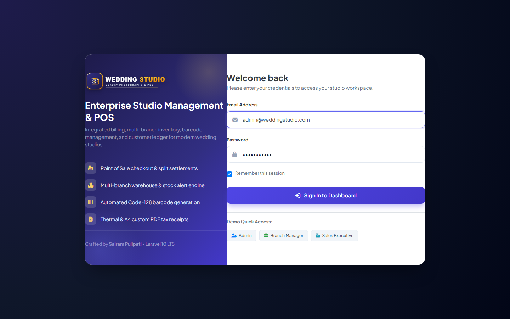
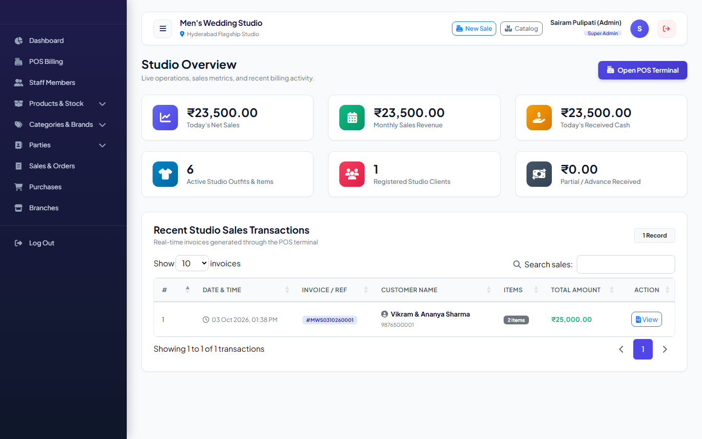
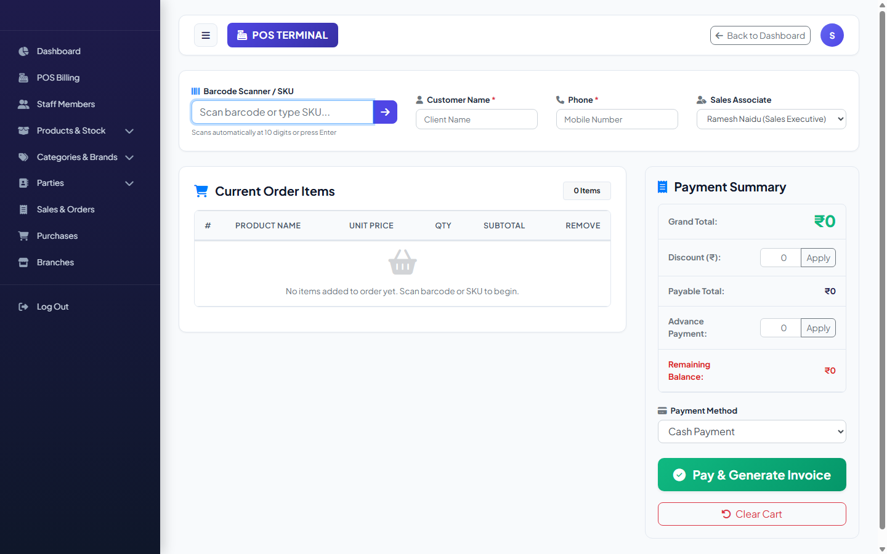
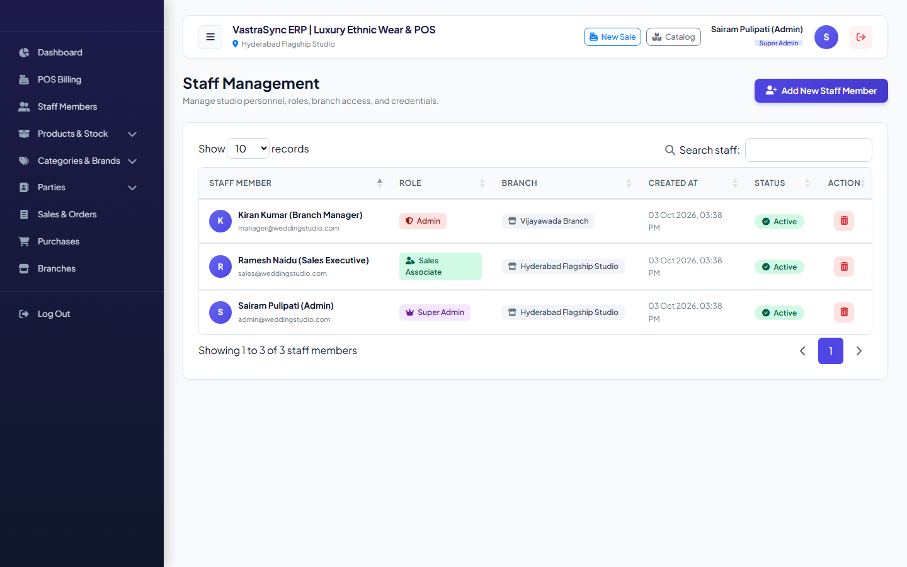
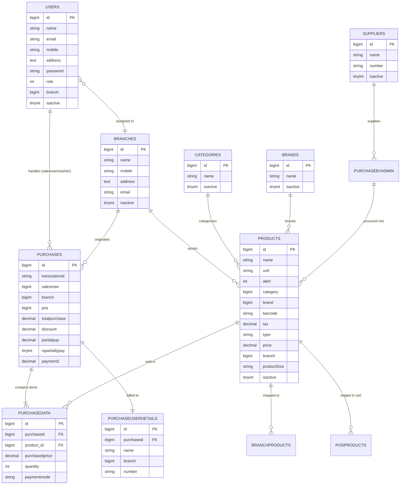

# Wedding Studio — Enterprise Billing & POS Management System

[](https://laravel.com)
[](https://www.php.net)
[](https://www.mysql.com)
[](https://getbootstrap.com)
[](https://www.linkedin.com/in/pulipati-sairam-b14820169/)
[](LICENSE)

---

## 📌 Overview

**Wedding Studio** is a comprehensive, production-grade Point of Sale (POS), Inventory, and Studio Management ERP application developed with **Laravel 10** and **PHP 8.2**. Designed specifically for high-end wedding photography studios, print labs, frame manufacturers, and cinematic media production houses, the platform streamlines multi-branch operations, service package billing, physical merchandise stock, barcode processing, and financial accounting.

Developed and maintained by **[Sairam Pulipati](https://www.linkedin.com/in/pulipati-sairam-b14820169/)**.

---

## 📸 Application Showcase

### 1. Modern Luxury Authentication & Role Access


### 2. Studio Overview & Financial Analytics Dashboard


### 3. Real-Time POS Billing & Barcode Terminal


### 4. Multi-Branch Staff Management & Role-Based Access Control (RBAC)


---

## ✨ Key Features & Capabilities

### 🛒 1. Point of Sale (POS) & Billing Terminal
- **Fast Barcode Item Lookup**: Direct scanning and barcode matching for rapid client checkout.
- **Dynamic Cart Management**: Real-time quantity adjustments, price overrides, and subtotal/tax computing.
- **Customized Package Support**: Seamlessly combines physical products (e.g., HD Albums, Canvas Frames) and service packages (e.g., 2-Day Pre-Wedding Shoots, 4K Drone Cinematic Films).
- **Flexible Settlement**: Supports Full Payment, Partial Advances, and Secondary Settlement collections with automatic balance tracking.

### 🏢 2. Multi-Branch & Warehouse Inventory
- **Multi-Branch Operations**: Isolate or aggregate sales, staff, and stock per branch (e.g., Hyderabad HQ, Vijayawada, Visakhapatnam).
- **Stock Depletion & Low-Stock Alerts**: Automatic decrement of inventory upon sale completion and threshold warnings.
- **Multi-Branch Allocation**: Distribute products to single or multiple branch showrooms simultaneously.

### 🏷️ 3. Barcode & PDF Invoicing Engine
- **Automated Barcode Generation**: Generates standard Code-128 barcodes for all catalogued inventory.
- **Bulk Barcode Sheets**: Export and print batch sheets for physical label affixing.
- **Thermal & A4 Invoices**: PDF generation using `barryvdh/laravel-dompdf` for printable customer tax receipts and delivery bills.

### 📦 4. Procurement & Supplier Accounting
- **Supplier Registry**: Manage vendor contacts, procurement ledgers, and invoice records.
- **Admin Purchase Tracking**: Track raw materials procurement (velvet sheets, acrylic mounts, outdoor lighting equipment, strobes).

### 👥 5. Role-Based Access Control (RBAC)
- **Role 1 (Super Admin)**: Complete system control, analytics across all branches, branch creation, and global configuration.
- **Role 2 (Branch Manager)**: Local inventory oversight, staff tracking, branch sales, and invoicing.
- **Role 5 (Sales Executive)**: POS terminal operation, order creation, and customer checkouts.

---

## 🗄️ Database Architecture & Entity Relationship Diagram (ERD)

The database schema has been reconstructed with modern migrations, foreign references, and realistic seed data:



---

## 🚀 Quick Start Guide

### Prerequisites
- **PHP**: `^8.2` (with `pdo_mysql`, `curl`, `gd`, `mbstring`, `openssl`, `zip`, `fileinfo` enabled)
- **Composer**: `^2.x`
- **Database**: MySQL `^8.0` / MariaDB `^10.4`
- **Web Server**: Apache / Nginx or Laravel built-in CLI server

---

### Step-by-Step Installation

#### 1. Clone the Repository
```bash
git clone https://github.com/SairamPulipati/weddingstudio.git
cd weddingstudio
```

#### 2. Install PHP Dependencies
```bash
composer install
```

#### 3. Environment Configuration
Copy `.env.example` to `.env` and set your MySQL credentials:
```bash
cp .env.example .env
```
Ensure your database parameters in `.env`:
```env
DB_CONNECTION=mysql
DB_HOST=127.0.0.1
DB_PORT=3306
DB_DATABASE=billing
DB_USERNAME=root
DB_PASSWORD=
```

#### 4. Generate Application Key
```bash
php artisan key:generate
```

#### 5. Run Migrations & Seeders
This builds all tables and populates realistic studio demonstration data:
```bash
php artisan migrate:fresh --seed
```

#### 6. Start the Development Server
```bash
php artisan serve
```
Visit **`http://127.0.0.1:8000`** in your browser.

> **Note for Windows/XAMPP users**: Convenience scripts `artisan.bat` and `serve.bat` are included in the repository root to automatically run with PHP 8.2:
> ```powershell
> .\serve.bat
> ```

---

## 🔑 Pre-Seeded Demonstration Accounts

The database seeder provisions initial test users across all system roles:

| Role | Name | Email | Password | Assigned Branch |
| :--- | :--- | :--- | :--- | :--- |
| **Super Admin** | Sairam Pulipati | `admin@weddingstudio.com` | `password123` | Hyderabad Flagship HQ |
| **Branch Manager** | Kiran Kumar | `manager@weddingstudio.com` | `password123` | Vijayawada Branch |
| **Sales Executive** | Ramesh Naidu | `sales@weddingstudio.com` | `password123` | Hyderabad Flagship HQ |

---

## 📁 Project Architecture & Directory Layout

```
billing/
├── app/
│   ├── Http/
│   │   └── Controllers/
│   │       ├── Admin/AdminController.php       # Core POS, analytics, staff, branch & report logic
│   │       ├── Auth/                           # Laravel authentication controllers
│   │       └── Product/productsDataController.php # Inventory, barcode, and catalog logic
│   ├── Models/
│   │   ├── Branch.php                          # Showrooms & studio branches
│   │   ├── Brands.php                          # Equipment & craft brands
│   │   ├── Category.php                        # Studio product categories
│   │   ├── Posproduct.php                      # POS cart items
│   │   ├── Product.php                         # Readymade & customized products
│   │   ├── Purchase.php                        # Sales transaction master
│   │   ├── PurchaseByAdmin.php                 # Supplier procurement records
│   │   ├── PurchaseDetails.php                 # Transaction line items
│   │   ├── PurchaseUserDetails.php             # Client purchase registry
│   │   ├── SuppilerDetails.php                 # Vendor & supplier profiles
│   │   └── User.php                            # User accounts with roles & relationships
├── database/
│   ├── migrations/                             # 15 complete migration schemas
│   └── seeders/
│       └── DatabaseSeeder.php                  # Realistic studio demo data seeder
├── resources/
│   └── views/                                  # Blade templates for POS, Invoicing, Admin
├── routes/
│   └── web.php                                 # Clean, grouped web & auth route definitions
├── artisan.bat                                 # Windows PHP 8.2 artisan launcher
├── serve.bat                                   # Windows PHP 8.2 development server launcher
└── composer.json                               # Laravel 10 LTS & modern PHP 8.2 dependencies
```

---

## 👨‍💻 Author & Developer

**Sairam Pulipati**  
*Full Stack Software Engineer & Laravel Specialist*  
- **LinkedIn**: [linkedin.com/in/pulipati-sairam-b14820169](https://www.linkedin.com/in/pulipati-sairam-b14820169/)  
- **GitHub**: [github.com/SairamPulipati](https://github.com/SairamPulipati)

---

## 📄 License & Intellectual Property

Copyright © 2026 **[Sairam Pulipati](https://github.com/SairamPulipati)**. All Rights Reserved.

This project is proprietary and licensed for evaluation, peer review, and employer assessment purposes only. Unauthorized reproduction, redistribution, or commercial use without prior written consent is strictly prohibited. See the [LICENSE](LICENSE) file for full details.
