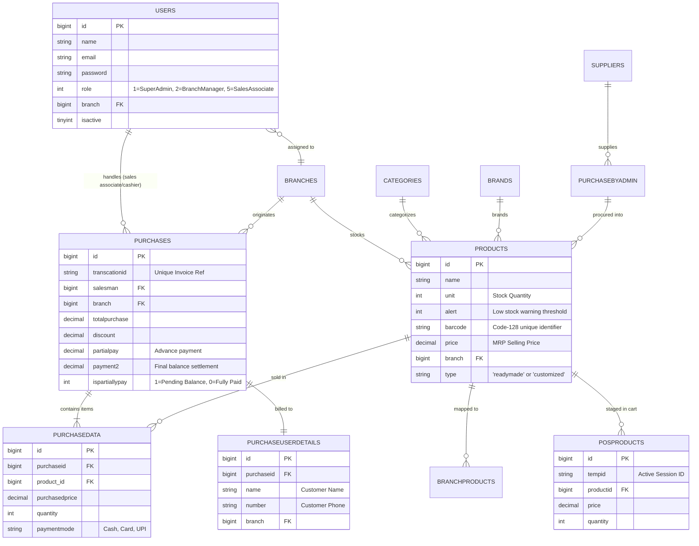

# VastraSync ERP — Complete Project Master Guide & Architecture Reference
**Author:** Sairam Pulipati  
**Technology Stack:** Laravel 10.x LTS | PHP 8.2 | MySQL 8.0 | Bootstrap 4.5 | DOMPDF  
**Business Domain:** Ethnic Wear Apparel Manufacturing, Multi-Branch Showrooms & Retail POS ERP  
**Document Purpose:** Comprehensive technical breakdown, code-level explanation, operational workflows, and interview preparation guide.

---

## 📑 Table of Contents
1. [Executive Summary & Business Domain](#1-executive-summary--business-domain)
2. [High-Level Architecture & Tech Stack](#2-high-level-architecture--tech-stack)
3. [End-to-End Operational Workflows](#3-end-to-end-operational-workflows)
4. [Database Schema & Entity Relationships (ERD)](#4-database-schema--entity-relationships-erd)
5. [Code-Level Deep Dive: Core Features & Logic](#5-code-level-deep-dive-core-features--logic)
   - [Authentication & Role-Based Access Control (RBAC)](#51-authentication--role-based-access-control-rbac)
   - [Catalog & Garment Inventory Engine](#52-catalog--garment-inventory-engine)
   - [POS Scanning & Session Cart Architecture](#53-pos-scanning--session-cart-architecture)
   - [Checkout, Transaction Master & Atomic Stock Decrement](#54-checkout-transaction-master--atomic-stock-decrement)
   - [Alteration Advances & Secondary Split Payment Collections](#55-alteration-advances--secondary-split-payment-collections)
   - [PDF Invoicing & Code-128 Barcode Generation Engine](#56-pdf-invoicing--code-128-barcode-generation-engine)
   - [Procurement & Supplier Accounting](#57-procurement--supplier-accounting)
6. [Laravel 10 Fundamentals Refresher (Quick Study)](#6-laravel-10-fundamentals-refresher-quick-study)
7. [Recruiter & Technical Interview Preparation Guide](#7-recruiter--technical-interview-preparation-guide)
8. [How to Convert This Document to PDF or Microsoft Word](#8-how-to-convert-this-document-to-pdf-or-microsoft-word)

---

## 1. Executive Summary & Business Domain

### What is VastraSync ERP?
**VastraSync** is a unified Enterprise Resource Planning (ERP), Multi-Branch Warehouse Inventory, and Point of Sale (POS) application designed specifically for **ethnic wear apparel manufacturers, bridal & groom fashion studios, and multi-location retail showrooms**.

### Why Was This Project Built?
Ethnic wear retail (Sherwanis, Kurtas, Indo-Western suits, Lehengas, and Designer Sarees) operates very differently from standard grocery or electronics retail:
1. **Custom Sizing & Tailor Alterations**: High-end garments almost always require custom alteration (shortening sleeves, tapering chests, waist adjustments). Customers rarely pay 100% upfront; they place a **booking advance**, come for a trial fitting, and pay the **remaining balance** on delivery.
2. **Barcode Hangtag Tracking**: Every finished garment requires standard Code-128 barcode hangtags with SKU, fabric type, and size labeling to avoid checkout mistakes.
3. **Multi-Showroom Distribution**: A central production unit or flagship store feeds multiple city branches (e.g., Hyderabad Flagship HQ, Vijayawada, Visakhapatnam). Inventory must be partitioned so each branch manager only oversees their local stock, while the Super Admin has bird's-eye visibility across all locations.
4. **Raw Material Procurement**: The business tracks raw fabric rolls (silk, brocade, velvet, linen) and accessories sourced from textile mills and suppliers before garments are tailored.

---

## 2. High-Level Architecture & Tech Stack

```
   ┌────────────────────────────────────────────────────────┐
   │             Client Layer (Browser / Laser Scanner)     │
   │      Bootstrap 4.5 • jQuery / AJAX • FontAwesome 6     │
   └───────────────────────────┬────────────────────────────┘
                               │ HTTP / HTTPS Requests
                               ▼
   ┌────────────────────────────────────────────────────────┐
   │             Laravel 10 LTS Application Layer           │
   │  ┌───────────────────────┐  ┌───────────────────────┐  │
   │  │   Auth & Session      │  │   Web Routing         │  │
   │  │   Middleware Engine   │  │   (routes/web.php)    │  │
   │  └──────────┬────────────┘  └──────────┬────────────┘  │
   │             ▼                          ▼               │
   │  ┌──────────────────────────────────────────────────┐  │
   │  │              Controllers                         │  │
   │  │  • AdminController.php (POS, Dashboard, RBAC)    │  │
   │  │  • productsDataController.php (Stock, Barcodes) │  │
   │  └──────────────────────┬───────────────────────────┘  │
   │                         ▼                              │
   │  ┌──────────────────────────────────────────────────┐  │
   │  │         Eloquent ORM & Business Logic            │  │
   │  │  User • Product • Branch • Purchase • Posproduct │  │
   │  └──────────────────────┬───────────────────────────┘  │
   │                         │                              │
   │                         ▼                              │
   │  ┌──────────────────────────────────────────────────┐  │
   │  │           Document Generation Engine             │  │
   │  │      DOMPDF (Thermal Slips, A4 Invoices, Tags)   │  │
   │  └──────────────────────────────────────────────────┘  │
   └───────────────────────────┬────────────────────────────┘
                               │ PDO MySQL Driver
                               ▼
   ┌────────────────────────────────────────────────────────┐
   │              Relational Database Layer                 │
   │            MySQL 8.0 (3NF Normalized Schema)           │
   └────────────────────────────────────────────────────────┘
```

- **Backend Framework:** Laravel 10.x LTS (PHP 8.2)
- **Database:** MySQL 8.0 / MariaDB (InnoDB engine, foreign keys, strict SQL mode)
- **Frontend / UI:** Blade Templates, Bootstrap 4.5, Plus Jakarta Sans typography, FontAwesome 6
- **PDF & Barcoding:** `barryvdh/laravel-dompdf` (generates 80mm thermal receipts and A4 designer invoices)

---

## 3. End-to-End Operational Workflows

### Operational Journey: From Procurement to Sale
1. **Procurement**:
   - Super Admin adds textile suppliers (`SuppilerDetails`) and records incoming fabric/apparel batches (`PurchaseByAdmin`).
2. **Product Cataloging**:
   - Outfits are registered in `products` with category, brand, SKU barcode, unit cost, MRP retail price, and branch allocation (`branchproducts`).
   - A single-item or bulk batch Code-128 barcode PDF sheet is printed and affixed to garment hangtags.
3. **Showroom POS Checkout**:
   - The customer selects a Sherwani or Kurta set at the Hyderabad Flagship Showroom.
   - The cashier scans the garment's barcode using a USB laser scanner.
   - AJAX instantly sends the barcode to `/purchaseproduct`, staging the item in the `posproducts` table bound to the cashier's active session.
4. **Alteration / Advance Split Payment**:
   - If alterations are needed, the customer deposits an advance (e.g., ₹5,000 against a ₹25,000 outfit).
   - Cashier enters ₹5,000 in `partialpay`.
   - The system records the sale in `purchases`, logs line items in `purchasedata`, logs client contact details in `purchaseuserdetails`, and automatically decrements the stock count by 1 in `products`.
5. **Final Settlement**:
   - When the customer returns for the fitting trial, the cashier pulls up the pending invoice, collects the ₹20,000 balance (`payment2`), and dispatches the final receipt.

---

## 4. Database Schema & Entity Relationships (ERD)

The database consists of 15 cleanly normalized tables:



---

## 5. Code-Level Deep Dive: Core Features & Logic

### 5.1 Authentication & Role-Based Access Control (RBAC)

#### The Code:
- Route: `Route::get('/Admin/login', [AdminController::class, 'adminlogin']);`
- Controller Method: `AdminController::adminlogin()`
- View: `resources/views/Admin/login.blade.php`

#### How RBAC Works:
Users are assigned numeric roles stored in `users.role`:
- **Role 1 (Super Admin)**: Has global system access. Can view analytics across all branches, add new branches, and register staff.
- **Role 2 (Showroom Manager)**: Scoped exclusively to their assigned `branch` ID. Can only view inventory and sales originating from their branch showroom.
- **Role 5 (Sales Associate / Cashier)**: Frontline showroom staff. Operates the POS terminal and conducts customer checkouts.

#### Role Isolation Query Example:
```php
// In AdminController::dashboardview()
if (Auth::user()->role == 1) {
    // Super Admin: sees all sales across all locations
    $Sales = Purchase::with(['customerdetails', 'purchasedetails'])->orderby('id', 'desc')->get();
    $DailyAmount = Purchase::whereDate('created_at', Carbon::today())->sum('totalpurchase');
} else {
    // Showroom Manager: scoped strictly to their assigned branch
    $Sales = Purchase::with(['customerdetails', 'purchasedetails'])
        ->where('branch', Auth::user()->branch)
        ->orderby('id', 'desc')
        ->get();
    $DailyAmount = Purchase::whereDate('created_at', Carbon::today())
        ->where('branch', Auth::user()->branch)
        ->sum('totalpurchase');
}
```

---

### 5.2 Catalog & Garment Inventory Engine

#### The Code:
- Controller: `App\Http\Controllers\Product\productsDataController`
- Methods: `ProductsList()`, `AddProduct()`, `stock()`
- Views: `resources/views/Product/Products.blade.php`, `stock.blade.php`

#### Key Logic in `AddProduct()`:
1. Validates and uploads the garment photo to `public/images/products/logos/`.
2. Generates an automated 10-digit random barcode item code if not manually scanned.
3. Sets `unit` (current showroom stock count) and `alert` (threshold count for restocking notifications).
4. Persists multi-branch inventory mapping in the `branchproducts` pivot table so multiple showrooms can stock the garment.

```php
public function AddProduct(Request $request)
{ 
    $filename = time() . '.' . request()->image->getClientOriginalExtension();
    request()->image->move(public_path('images/products/logos'), $filename);

    $AddProduct = new Product;
    $AddProduct->name = $request->productName;
    $AddProduct->unit = $request->productUnit;
    $AddProduct->alert = $request->quantityAlert;
    $AddProduct->category = $request->category;
    $AddProduct->brand = $request->brand;
    $AddProduct->barcode = $request->itemCode;
    $AddProduct->price = $request->mrp;
    $AddProduct->type = 'readymade';
    $AddProduct->branch = $request->branches[0];
    $AddProduct->save();

    // Map to multi-branch distribution pivot
    foreach ($request->branches as $branch) {
        $BranchProduct = new Branchproduct;
        $BranchProduct->branchid = $branch;
        $BranchProduct->productid = $AddProduct->id;
        $BranchProduct->isactive = 1;
        $BranchProduct->save();
    }
    return redirect()->back()->with('message', 'Product added successfully');
}
```

---

### 5.3 POS Scanning & Session Cart Architecture

#### The Code:
- Controller Methods: `AdminController::pos()`, `AdminController::purchaseproduct()`
- View: `resources/views/Admin/pos.blade.php`

#### Architectural Innovation: Zero-Conflict Session Cart
Instead of relying on unstable client-side `localStorage`, the cart state is stored in the database table `posproducts` keyed by `\Session::getId()`:
1. When a cashier scans a barcode at the register:
   ```javascript
   // AJAX call from pos.blade.php
   $.ajax({
       url: "/purchaseproduct",
       type: "GET",
       data: { posnumber: barcodeValue, randomnumber: sessionId },
       success: function(response) {
           location.reload(); // Re-renders updated cart with new subtotal
       }
   });
   ```
2. The controller finds the product by its barcode:
   - If the product is not in the cashier's cart: creates a new `Posproduct` record with `quantity = 1`.
   - If already in the cart: executes `Posproduct::increment('quantity', 1)`.

```php
public function purchaseproduct(Request $request)
{
    $GetProduct = Product::where('barcode', $request->posnumber)->first();
    $CheckExist = Posproduct::where('tempid', \Session::getId())->where('productid', $GetProduct->id);
    
    if ($CheckExist->count() == 0) {
        $Product = new Posproduct; 
        $Product->tempid = \Session::getId();
        $Product->productid = $GetProduct->id;
        $Product->price = $GetProduct->price;
        $Product->quantity = 1;
        $Product->save();
        return 1;
    } else {
        $CheckExist->increment('quantity', 1);
        return 1;
    }
}
```

---

### 5.4 Checkout, Transaction Master & Atomic Stock Decrement

#### The Code:
- Method: `AdminController::purchaseproducts(Request $request)`
- Master Table: `purchases`
- Line Items Table: `purchasedata`
- Customer Table: `purchaseuserdetails`

#### How Checkout Executes Atomically:
1. Calculates grand subtotal from `posproducts` for the active session.
2. Formats a structured, business-branded transaction ID:
   `'MWS' . date("d") . date("m") . date("y") . '000' . ($dailyCount + 1)` (e.g. `MWS0310260001`).
3. Creates the master record in `purchases`.
4. Loops through cart items, saving line items into `purchasedata`.
5. **Atomic Stock Decrement**: For every sold item, it immediately decrements showroom inventory:
   ```php
   Product::where('id', $Product->productid)->decrement('unit', $Product->quantity);
   ```
   *Why this matters in interviews:* Calling `decrement()` directly in Eloquent translates to a native `UPDATE products SET unit = unit - 1 WHERE id = ?` atomic SQL query. This prevents concurrency race conditions where two cashiers sell the last piece of a garment at the same moment.
6. Records customer contact in `purchaseuserdetails`.
7. Wipes the staged session cart (`Posproduct::where('tempid', $session)->delete()`).

---

### 5.5 Alteration Advances & Secondary Split Payment Collections

#### The Business Problem:
In ethnic wear, a customer ordering a ₹30,000 sherwani may pay ₹10,000 advance for sizing alterations and ₹20,000 upon pickup 5 days later.

#### The Implementation:
- In `purchases`:
  - `partialpay`: Stores the first payment (e.g., ₹10,000).
  - `ispartiallypay`: Flagged as `1` (pending remaining balance).
  - `payment2`: Stores the final balance collected on delivery.
- In `AdminController::secondpayment()`:
  - Takes `invoiceid` and `secondpayment` amount.
  - Updates `purchases.payment2 = $request->secondpayment` and flips `ispartiallypay = 0`.
  - Dispatches the final delivery release receipt.

---

### 5.6 PDF Invoicing & Code-128 Barcode Generation Engine

#### The Code:
- Route: `/printpdf` and `/downloadbarcode/{data}`
- Library: `barryvdh/laravel-dompdf` (Dompdf Wrapper for Laravel)
- Views: `resources/views/billing.blade.php`, `Product/Barcode.blade.php`

#### Dual Invoicing Capabilities:
1. **80mm Thermal Receipt**: Compact thermal format for standard retail receipt printers (POS counter).
2. **A4 Designer Tax Invoice**: High-resolution branded invoice with GST details, branch showroom address, itemized breakdown, and terms of exchange.

---

### 5.7 Procurement & Supplier Accounting

#### The Code:
- Model: `PurchaseByAdmin.php`, `SuppilerDetails.php`
- Controller Methods: `Purchases()`, `addpurchase()`, `supplierslist()`
- View: `resources/views/sales/purchases.blade.php`

Tracks vendor profiles (textile mills, zardozi embroidery craftsmen), raw material procurement invoices, purchase quantities, unit rates, and incoming batch timestamps.

---

## 6. Laravel 10 Fundamentals Refresher (Quick Study)

If you haven't touched Laravel in a while, here is everything you need to remember in 5 minutes:

### 1. The MVC Request Lifecycle
- **Route (`routes/web.php`)**: Catches the HTTP URL and maps it to a Controller method:
  `Route::get('/pos', [AdminController::class, 'pos'])->name('pos');`
- **Controller (`app/Http/Controllers/`)**: Receives the incoming `Request`, interacts with Models, performs business logic, and returns a View or JSON response.
- **Model (`app/Models/`)**: Represents a database table using Eloquent ORM. Handles relationships (`hasMany`, `belongsTo`).
- **View (`resources/views/`)**: Blade templates (`.blade.php`) that compile into clean HTML sent to the browser.

### 2. Blade Directives You Need to Know
- `@extends('Admin.topnavbar')`: Inherits the master HTML layout.
- `@section('content') ... @endsection`: Fills the dynamic content block.
- `{{ $variable }}`: Safely prints escaped data (prevents XSS vulnerabilities).
- `{!! $html !!}`: Renders raw HTML (used when rendering barcodes or icons).
- `@if(Auth::user()->role == 1) ... @endif`: Conditional rendering based on role.
- `@foreach($products as $product) ... @endforeach`: Iterates through database collections.

### 3. Eloquent ORM & Query Builder Syntax
- `Product::where('isactive', 1)->get()`: Fetches all active products (equivalent to `SELECT * FROM products WHERE isactive = 1`).
- `Product::find(5)`: Finds record where `id = 5`.
- `Purchase::with(['customerdetails', 'purchasedetails'])->get()`: **Eager loading** — loads related customer and item records in a single optimized query, avoiding the $N+1$ query performance problem.
- `$product->save()`: Inserts a new record if new, or runs an `UPDATE` query if existing.

### 4. Important Artisan Commands
- `php artisan serve`: Boots local dev server at `http://127.0.0.1:8000`.
- `php artisan migrate`: Runs pending database migrations.
- `php artisan migrate:fresh --seed`: Drops all tables, recreates schema, and populates realistic demo seed data.
- `php artisan route:list`: Prints all registered routes, HTTP methods, and controller actions.

---

## 7. Recruiter & Technical Interview Preparation Guide

### 🎤 The 60-Second Elevator Pitch
> *"I built VastraSync, an enterprise ERP, Multi-Branch Inventory, and Point of Sale application engineered with Laravel 10 and MySQL. It was built specifically for high-end ethnic wear manufacturing and multi-location retail showrooms. It manages the complete apparel lifecycle: from tracking raw fabric procurement to generating Code-128 barcode hangtags, managing showroom inventory across multiple city branches, handling split alteration advance bookings, and executing high-speed POS checkouts with thermal and A4 GST invoicing. The database is strictly 3NF normalized, and all checkout operations use atomic decrement transactions to ensure concurrency safety."*

---

### 💡 Common Interview Questions & Winning Answers

#### Q1: "Why did you use database-backed session carts (`posproducts`) instead of client-side JavaScript or LocalStorage?"
> **Your Answer:**  
> *"In a busy retail showroom environment, cashiers frequently pause transactions—for example, if a customer steps away to look at another outfit or try a fitting. Storing the cart in `posproducts` keyed by the server session ID ensures the cart state is resilient. Even if the cashier refreshes the page, the cart data is safely preserved. Furthermore, prices are resolved server-side directly from the database, preventing any client-side price tampering or stale local cache issues."*

#### Q2: "How did you prevent inventory race conditions during POS checkout?"
> **Your Answer:**  
> *"When completing a purchase in `AdminController::purchaseproducts`, rather than reading the stock in PHP, subtracting in memory, and writing it back, I utilized Eloquent’s atomic `decrement('unit', $quantity)` method. This translates directly to `UPDATE products SET unit = unit - ? WHERE id = ?` at the MySQL engine level, relying on InnoDB row-level locking to guarantee concurrency safety even if two cashiers bill the same SKU simultaneously."*

#### Q3: "How does the system ensure multi-branch data isolation?"
> **Your Answer:**  
> *"We implemented a 3-tier Role-Based Access Control (RBAC) model. The `users` table contains both a `role` identifier and a foreign key to `branches`. At the controller query level, requests from Showroom Managers (Role 2) are automatically scoped with `where('branch', Auth::user()->branch)`. Super Admins (Role 1) bypass this filter to access aggregated analytics and cross-branch stock distribution."*

#### Q4: "How does VastraSync handle partial payments and alteration advances?"
> **Your Answer:**  
> *"Because ethnic wear purchases almost always require bespoke tailoring or sizing adjustments, our `purchases` table has first-class support for split settlements. We track initial advance deposits via `partialpay` and flag the order with `ispartiallypay = 1`. When the customer returns for their final fitting trial, the cashier pulls up the invoice and processes `payment2`, which settles the remaining balance and releases the final receipt."*

---

## 8. How to Convert This Document to PDF or Microsoft Word

You can easily convert this guide into a professional PDF or Word document:

### Option A: Print to PDF from Browser (Recommended & Fastest)
1. Open this file `VASTRASYNC_MASTER_GUIDE.md` in VS Code or GitHub.
2. In VS Code: Press `Ctrl + Shift + P` → select **Markdown: Open Preview to the Side**.
3. Right-click the preview → select **Print** (or install the *"Markdown PDF"* extension).
4. Select **Save as PDF** → Paper size: A4 → Click **Save**.

### Option B: Open in Microsoft Word
1. Copy all the text in this document.
2. Open Microsoft Word → paste the content. Word will automatically render the headers, tables, and bullet points cleanly.
3. Click **File** → **Save As** → choose **PDF (*.pdf)** or **Word Document (*.docx)**.

---
*© 2026 Sairam Pulipati. All Rights Reserved. Built with Laravel 10 LTS & PHP 8.2.*
